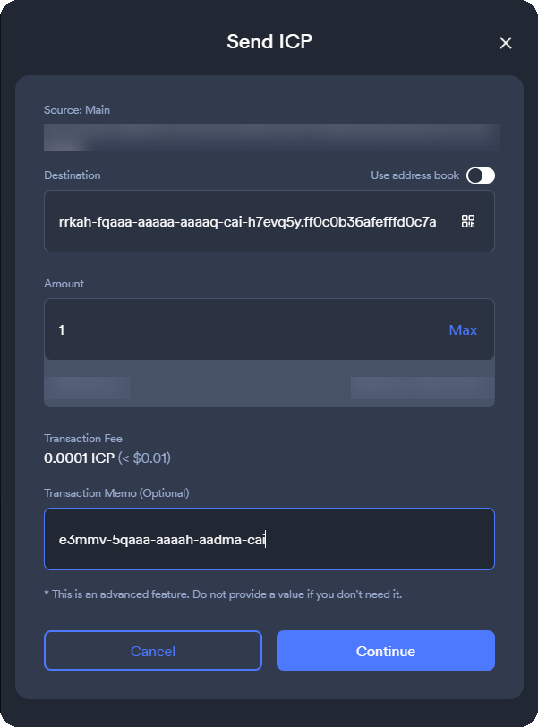

# Jupiter Faucet Suite


### [Jupiter Faucet](https://jupiter-faucet.com/#intro) is a perpetual cycles top-up protocol for the Internet Computer - built to help canister smart contracts keep running indefinitely.
Its goal is simple: turn a durable ICP source into durable cycles for canisters, while keeping the value-moving path narrow, deterministic, and hard to tamper with. The [Internet Computer](https://dashboard.internetcomputer.org/) is designed for tamperproof, "unstoppable" on-chain services; Jupiter Faucet focuses on the practical part: making sure canisters don’t run out of cycles, even if nobody is maintaining the project.

In the current production design, one NNS neuron is the economic source of truth. The suite uses that neuron’s recurring maturity and relay-retained ICP to sustain three long-lived on-chain flows:

1. an **age-bonus / maturity routing flow**, handled by `jupiter-disburser`
2. a **participant commitment and payout flow**, handled by `jupiter-faucet`
3. a **suite self-funding and surplus routing flow**, handled by `jupiter-relay`

These flows are supported by `jupiter-historian`, which provides historical indexing and observability for tracked canisters and faucet-related activity.

The operational canisters are intentionally small and specialized. The normal path is designed to settle into self-management plus canonical blackhole control, with a separate recovery canister available if value flow stops for long enough that rescue is justified. The production intent is that this lifeline principal is governed by the SNS DAO rather than any individual.

## System map

### Operational path

- `jupiter-disburser`
  - controls one NNS neuron
  - disburses **100% of available maturity** to its own default ICP ledger account
  - applies the fixed base/bonus routing policy
- `jupiter-faucet`
  - receives the base ICP flow from `jupiter-disburser`
  - scans a configured staking account through the ICP index canister
  - evaluates each qualifying incoming transfer independently
  - interprets the transfer's `icrc1_memo` as a payout directive
  - routes payouts as canister cycle top-ups, raw ICP transfers, or NNS neuron stake transfers
- `jupiter-relay`
  - receives raw ICP from the faucet via the production memo `u2qkp-aqaaa-aaaar-qb7ea-cai.`
  - samples cycles balances for the managed Jupiter Faucet Suite canisters
  - tops up recent burn plus a fixed 1% headroom
  - splits remaining production surplus ICP equally between the IO neuron and Jupiter Faucet neuron recipients

### Observability path

- `jupiter-historian`
  - incrementally indexes the same staking account used by the faucet
  - keeps memo-derived and SNS-discovered canister sets
  - records capped commitment history, burn history, and cycles samples
  - exposes the public read model used by the production frontend
- `jupiter-faucet-frontend`
  - serves the public site as certified assets
  - loads dashboard data through generated Candid declarations
  - reads from `jupiter-historian`, the configured ledger canister, and NNS Governance

### Recovery / support canisters

- `jupiter-lifeline`
  - minimal recovery canister intended to be added as a controller only when rescue is required
  - production intent is for this principal to be governed by the SNS DAO
- `jupiter-sns-rewards`
  - current placeholder recipient for the primary age-bonus ICP flow
  - present today mainly to reserve the production principal and default ledger account until reward logic lands

## End-to-end value flow

The live value-moving path is:

1. `jupiter-disburser` controls one NNS neuron.
2. When NNS reports that no maturity disbursement is currently in flight, the disburser first drains any already-disbursed ICP sitting in its own default ledger account according to the currently persisted payout plan, if one exists.
3. In that same no-overlap case, the disburser then initiates `DisburseMaturity` for **100%** of available maturity to its own default ledger account.
4. When that staged ICP is later paid out, it is split into:
   - the **age-neutral base** share for `jupiter-faucet`
   - **95% of the age bonus** for `jupiter-sns-rewards`
   - **5% of the age bonus** for the D-QUORUM neuron staking account
5. `jupiter-faucet` periodically snapshots:
   - its own payout-account ICP balance
   - the configured staking-account ICP balance
6. It scans the staking-account transaction history from the beginning and evaluates each eligible incoming transfer independently.
7. For each qualifying commitment, the faucet parses the transfer's `icrc1_memo` as a payout directive:
   - plain declared canister ID text declares a canister cycle top-up target
   - `canister_id.memo` declares a raw ICP transfer target and outgoing ledger memo
   - decimal neuron ID text declares an NNS neuron stake transfer target; `neuron_id.memo` also sets the outgoing ledger memo
8. If the computed payout share is larger than the ledger fee, the faucet routes the payout:
   - canister top-up directives send ICP to the target canister's CMC deposit subaccount and call `notify_top_up`
   - raw ICP directives send ICP directly to the declared canister's default account
   - neuron directives resolve the public neuron's staking subaccount, send ICP to that account, and then best-effort call `claim_or_refresh_neuron`
9. The production suite uses the raw ICP directive `u2qkp-aqaaa-aaaar-qb7ea-cai.` to fund `jupiter-relay`. The trailing `.` uses the faucet raw-ICP memo syntax and produces an empty outgoing memo to the relay default account.
10. `jupiter-relay` spends that default-account ICP by topping up managed suite canisters first. Each planned top-up is capped at recent burn plus 1%, and surplus routing is disabled until all probes, prior samples, and conversion data are usable.
11. After planned canister top-ups for a tick are complete, remaining ICP after per-transfer ledger fees is split equally between two production surplus recipients:
   - the IO neuron `6345890886899317159`, with an empty memo blob/no outgoing memo, for immediate IO stake growth
   - the Jupiter Faucet neuron `11614578985374291210`, with memo blob `6345890886899317159`, for compounding Jupiter Faucet neuron growth that feeds long-term IO-aligned maturity

The faucet payout path is intentionally **best effort**. Each eligible commitment is attempted independently, with at most one immediate inline retry for selected transient external calls, including ambiguous transfer / notify boundaries and NNS staking-subaccount lookup. CMC `notify_top_up` is used only for canister top-up directives; raw ICP and neuron-stake directives are plain ledger transfers, with neuron transfers followed by a best-effort NNS `claim_or_refresh_neuron` call. A failed claim/refresh does not imply funds are lost: the endpoint is public, and later natural NNS flow or a manual/public retry can refresh the neuron. Deterministic failures are counted in `failed_topups`; exhausted retry paths that may already have partially settled are counted in `ambiguous_topups`. The job still continues rather than buffering deferred retry work or adding unbounded durable queues. The faucet also rejects obviously invalid memo targets such as the anonymous principal and the management canister principal.

For the exact split math, memo formats, retry semantics, and rescue logic, the component READMEs are the canonical source:

- [`jupiter-disburser/README.md`](jupiter-disburser/README.md)
- [`jupiter-faucet/README.md`](jupiter-faucet/README.md)
- [`jupiter-relay/README.md`](jupiter-relay/README.md)

## How a target opts into the faucet flow

At a high level, a participant:

1. transfers ICP into the faucet neuron’s configured ICRC-1 staking account address `rrkah-fqaaa-aaaaa-aaaaq-cai-h7evq5y.ff0c0b36afefffd0c7a4d85c0bcea366acd6d74f45f7703d0783cc6448899c68`
2. puts a supported declaration in the transfer memo as ASCII text

The primary flow is still canister cycle top-up: put the **declared canister ID** in `icrc1_memo`. The committer does **not** need to own the declared canister. The parser accepts short ASCII principal text that fits within the memo constraint; in practice, principals short enough for this path are canister principals, while ordinary non-canister principal IDs are too long for the 32-byte memo limit. Anonymous and management canister principals remain rejected.

Advanced memo forms are also supported in `icrc1_memo`: `canister_id.memo` routes raw ICP to the declared canister's default account with the right-hand memo segment as the outgoing ledger memo, and a decimal NNS neuron ID routes ICP to that neuron's staking account. Neuron commitments require the neuron to be public, because the faucet must read the neuron through NNS Governance to resolve its staking subaccount before sending the transfer.

The supported memo path is ASCII text carried in `icrc1_memo`; use the ICRC-1 account address above in the [NNS dapp](https://nns.ic0.app/wallet/?u=) so that text memo path is available. The old 64-bit legacy memo field is intentionally ignored; numeric neuron IDs are supported only when supplied as ASCII text in `icrc1_memo`.

The suite intentionally does **not** hard-code textual conventions such as a `-cai` suffix check. Declared canister ID text is treated as syntax only. The value-moving faucet path does not eagerly probe the network to confirm that a memo target characterizes a canister, because keeping that path minimal reduces unnecessary cost and preserves the blackholed canister's resilience against cycle-drain pressure. Accepted memo text is therefore a project policy input, not a proof that the beneficiary is an installed canister; if the current CMC top-up path accepts the target, the faucet may still attempt the top-up. This is intentional simplicity, not a missing validation layer.

That means the project deliberately accepts a bounded griefing surface: a committer can supply syntactically valid short principal text that does not correspond to a useful installed canister, and the faucet may still spend ledger fee / CMC work attempting the top-up. If some short non-canister principal text exists and passes the current CMC path, that is parser / CMC behavior rather than a supported user-facing target. The production answer to that trade-off is economic rather than heuristic. The memo path is kept simple and non-probing, while the production `min_tx_e8s` remains high enough that repeatedly funding such attempts is materially costly to the attacker and simultaneously adds real protocol funding into the staking path.

This distinction matters because the ICP/Cycles ecosystem now has two different concepts: principals can hold cycles directly through the cycles ledger, but the faucet's normal `notify_top_up` path is still a **canister top-up** path rather than a general “mint cycles to arbitrary principal” path. Operationally, the primary UX remains: put the **declared canister ID** in `icrc1_memo`.

### [NNS dapp](https://nns.ic0.app/wallet/?u=) memo tip

In the [NNS dapp](https://nns.ic0.app/wallet/?u=), the transaction memo field may be hidden by default. If it is not visible:

1. press **Ctrl + K**
2. type **memo**
3. select **Show transaction memo**
4. send ICP to the long-form **ICRC-1** staking account address above (not the short-form legacy account identifier), then put your supported declaration into the memo field as plain ASCII text

The long-form ICRC-1 destination address is important: the [NNS dapp](https://nns.ic0.app/wallet/?u=) only enables larger text-based memos on that path, so that is the format required for the destination account in order for the memo to be capable of holding a declared canister ID, `canister_id.memo` raw-ICP directive, or decimal neuron ID.

[](https://nns.ic0.app/wallet/?u=)

[](https://nns.ic0.app/wallet/?u=)

Important details that matter in practice:

- the faucet only considers non-empty `icrc1_memo` bytes as a beneficiary memo
- legacy numeric memos are ignored entirely; neuron IDs must be ASCII digits in `icrc1_memo`
- an empty `icrc1_memo` is treated as missing / invalid
- only incoming `Transfer` records **to** the staking account are treated as commitments; `TransferFrom` records are ignored
- whitespace around the declaration text is tolerated because the parser trims before decoding
- the trimmed memo must be ASCII and at most 32 bytes
- empty, malformed, or oversize memos are ignored
- commitments below `min_tx_e8s` are ignored for durable beneficiary registration and faucet eligibility; historian only keeps a capped recent feed for the below-threshold attempts and does not retain those canisters in its tracked registry
- each eligible commitment is processed independently; same-beneficiary commitments are **not** aggregated into one synthetic record, so separate qualifying commitments for the same beneficiary may incur separate outbound fees
- each new payout job rescans the full staking history against a fresh payout-pot snapshot in a streaming, page-by-page pass; large barren spans are cached as durable skip ranges to reduce repeated replay work, and every upgrade intentionally clears that cache before the faucet resumes so historical staking activity is re-evaluated conservatively under the newly running code/config
- stake additions near a payout boundary are handled with round-aware weighting rather than the raw live staking balance alone: the faucet carries forward a round-start snapshot, clamps the round by tx id, and applies a conservative stake-recognition delay before weighting valid in-round commitments into the effective denominator. This delay is faucet-side accounting only; it does not change NNS maturity accrual, maturity spawning, or disburser timing. A commitment becomes effective at `commitment_time + stake_recognition_delay_seconds`; effective at or before round start means full weight, effective during the round means linear prorating, and effective at or after round end means zero current-round weight. The funding cursor tracks consumed payout-account funding transfers only; staking-history scans still replay historical commitments. The weighting and boundary logic are unit-tested in the faucet and exercised in PocketIC across the live stake -> maturity -> payout flow, including production-delay coverage.

The production minimum is intentionally **1 ICP** so beneficiary-registry spam stays expensive. The code also enforces an absolute floor of **0.1 ICP** because lower values can become dust once weekly top-up fees are considered in weak ICP-price conditions. Historian keeps a durable registry of memo-derived beneficiaries so it can efficiently monitor and display later cycle top-up activity; a much lower threshold would let an attacker register huge numbers of canisters very cheaply.

The faucet also intentionally keeps skip-range persistence conservative instead of turning it into a second durable index. The current `10_000`-transaction minimum was chosen as an economic trade-off: large barren spans are worth caching, but below-threshold spans are allowed to replay because the estimated long-run replay cost remains favorable relative to the 1 ICP commitment needed to keep creating those spans, while durable state stays compact and the implementation stays simpler and easier to trust.

See [`jupiter-faucet/README.md`](jupiter-faucet/README.md) for the exact rules and examples.

## What each canister exposes in production

- `jupiter-disburser`
  - no public production methods beyond installation / upgrade
- `jupiter-faucet`
  - no public production methods beyond installation / upgrade
- `jupiter-relay`
  - no public production methods beyond installation / upgrade
  - public verification is through logs, source/module metadata, and the frontend source verification view
- `jupiter-historian`
  - public read-only query API for counts, status, histories, summaries, recent commitments, and recent burns
  - the historian keeps a durable beneficiary registry plus bounded history/recent-feed views in canister state; the canonical full transfer history remains on the ICP ledger and its archive canisters, and if tracked-canister cardinality ever becomes an operational issue the intended next step is an archive canister rather than a hard cap in the live historian
- `jupiter-faucet-frontend`
  - `http_request` for certified asset serving
- `jupiter-lifeline`
  - no public methods
- `jupiter-sns-rewards`
  - no public methods

That split is intentional: the value-moving canisters stay narrow; the public read surface lives in the historian and frontend.

## Build reproducibility

The release build expects committed lockfiles (`Cargo.lock` and `package-lock.json`) and uses `npm ci` for the frontend bundle path. `Dockerfile.repro` pins the Debian package universe through `snapshot.debian.org`, downloads a versioned `rustup-init` artifact, verifies that binary against a committed SHA256, and emits a deterministic `release-artifacts/build-info.json` manifest capturing the exact toolchain versions and key input hashes used for the build. The helper script `scripts/verify-reproducible-artifacts` rebuilds the release artifact twice from scratch (`--no-cache`) and diffs the resulting file hashes so reproducibility can be checked in CI or before cutting a release.

This is deterministic rebuild verification in a pinned environment, not a claim of fully independent long-term third-party reproducibility. Remaining trust assumptions are explicit: Rust toolchains are fetched from the Rust distribution service after the checked `rustup-init` bootstrap, Rust crates resolve through `Cargo.lock`, npm packages resolve through `package-lock.json`, Debian packages come from the configured snapshot archive, and the final confidence check is same-environment double-build equality.

## Production canisters recorded in this repo

These production canister IDs are recorded in `.icp/data/mappings/ic.ids.json`:

- `jupiter-disburser` — `uccpi-cqaaa-aaaar-qby3q-cai`
- `jupiter-faucet` — `acjuz-liaaa-aaaar-qb4qq-cai`
- `jupiter-historian` — `j5gs6-uiaaa-aaaar-qb5cq-cai`
- `jupiter-lifeline` — `afisn-gqaaa-aaaar-qb4qa-cai`
- `jupiter-sns-rewards` — `alk7f-5aaaa-aaaar-qb4ra-cai`
- `jupiter-faucet-frontend` — `jufzc-caaaa-aaaar-qb5da-cai`
- `jupiter-relay` — `u2qkp-aqaaa-aaaar-qb7ea-cai`

These core canisters are deployed on the Fiduciary subnet:

- `pzp6e-ekpqk-3c5x7-2h6so-njoeq-mt45d-h3h6c-q3mxf-vpeq5-fk5o7-yae`

## External system canisters and dependencies

The suite relies on the following external canisters and protocols:

- ICP Ledger (`ryjl3-tyaaa-aaaaa-aaaba-cai` by default)
- ICP Index (`qhbym-qaaaa-aaaaa-aaafq-cai` by default)
- NNS Governance (`rrkah-fqaaa-aaaaa-aaaaq-cai` by default)
- Cycles Minting Canister / CMC (`rkp4c-7iaaa-aaaaa-aaaca-cai` by default)
- canonical blackhole canister (`77deu-baaaa-aaaar-qb6za-cai` by default)
- SNS-WASM (`qaa6y-5yaaa-aaaaa-aaafa-cai` by default, for historian SNS discovery)

The frontend also depends on generated JS declarations for the historian and a ledger actor surface.

## Blackholing and recovery model

The suite is designed around **self-management plus rescue handoff**, not around leaving operational canisters permanently under unilateral human control.

In practice that means:

- `jupiter-disburser` and `jupiter-faucet` are intended to converge to **self + blackhole** controllers while healthy
- each canister persists enough local state to decide when value flow has stopped for long enough that rescue is justified
- once rescue triggers, the canister widens its controller set to include `jupiter-lifeline` alongside `self + blackhole`

Both value-moving canisters use the same basic time windows when blackhole mode is armed:

- healthy: `<= 7 days` since the last successful transfer / top-up notification
- middle window: `> 7 days` and `<= 14 days`
- broken: `> 14 days`

But the faucet also has extra forced-rescue latches tied to index-health and zero-success CMC runs, so the component docs remain the canonical source.

## Current placeholders and deliberate omissions

The following components are intentionally minimal today:

- `jupiter-sns-rewards`
- `jupiter-lifeline` (recovery code is expected to be added only if a real rescue event occurs)

Those can largely be ignored when building a first-principles understanding of the live operational path.

## Repository layout

- `jupiter-disburser/` — maturity-routing canister
- `jupiter-faucet/` — cycles top-up canister
- `jupiter-historian/` — commitment, burn, and cycles-history canister
- `jupiter-relay/` — suite self-funding, cycles top-up, and surplus-routing canister
- `jupiter-faucet-frontend/` — certified public frontend canister and browser bundle source
- `jupiter-lifeline/` — recovery canister
- `jupiter-sns-rewards/` — placeholder rewards canister
- `xtask/` — local orchestration, mocks, integration suites, and PocketIC suites
- `scripts/` — repository build helpers
- `third_party/` — vendored dependencies used by the build and test paths
- `release-artifacts/` — generated release output

## Build and test

### Reproducible release artifacts

```bash
chmod +x scripts/docker-build scripts/build-canister
./scripts/docker-build
```

That produces canonical release artifacts under `release-artifacts/`.

### Local one-off builds

```bash
./scripts/build-canister all
```

Notes:

- the frontend build requires Node.js / npm because the browser bundle is built before the Rust asset canister is compiled
- the build helper stamps content-hashed frontend bundle paths and an asset version into the checked-in static assets before compiling the frontend canister

To build a single canister, for example:

```bash
./scripts/build-canister jupiter-disburser
```

### Test orchestration

The preferred entry point for local Rust/canister testing is `xtask`.

### Stable-state compatibility and upgrades

Stateful canisters keep small stable-state compatibility tests near their state modules. Tests that dynamically encode local legacy structs are legacy-shape compatibility checks: they prove the current `VersionedStableState` can decode the modeled prior shape, preserve meaningful fields, and apply safe defaults for new optional fields. Do not describe these as golden fixtures unless the repo contains checked-in Candid bytes, Candid text, or another committed artifact generated from a prior release.

When a stable schema changes, add a minimal representative legacy-shape test or, where release provenance matters, add a true checked-in fixture under a small test fixture path. Keep fixtures small and reviewable rather than copying production dumps.

Routine upgrades must preserve stable state and must not accidentally receive init/install args. Deployment validation should keep fresh install/reinstall args separate from normal upgrade commands.

Examples:

```bash
cargo run -p xtask -- test_unit
cargo run -p xtask -- test_local_integration
cargo run -p xtask -- test_pocketic_integration
cargo run -p xtask -- test_all
```

Frontend-focused browser/data-loader tests are also available through `xtask` now:

```bash
cargo run -p xtask -- frontend_setup
cargo run -p xtask -- frontend_unit
cargo run -p xtask -- frontend_local_integration
cargo run -p xtask -- frontend_all
```

The underlying npm entry points still work when you want to run just the Node tests directly (`test:frontend-unit` auto-discovers every `frontend-src/test/*.test.mjs` file):

```bash
npm run setup:frontend
npm run test:frontend-unit
npm run test:frontend-dashboard-local
```

For the full command matrix and what each layer covers, see [`xtask/README.md`](xtask/README.md).

## Committed mainnet install/reinstall args

Committed copy-pasteable install args live alongside the main operational canisters:

- `jupiter-disburser/mainnet-install-args.did`
- `jupiter-faucet/mainnet-install-args.did`
- `jupiter-historian/mainnet-install-args.did`
- `jupiter-relay/mainnet-install-args.did`

These are the repo’s source of truth for fresh install/reinstall wiring captured in version control. Committed `mainnet-install-args.did` files are reviewed install/reinstall inputs only. They are not wired into `icp.yaml` because routine production deploys are upgrades and should not pass install args.

Routine production upgrades should use:

```bash
icp deploy <canister_name> --environment ic
```

For example:

```bash
icp deploy jupiter_faucet --environment ic
```

This performs a normal upgrade with no upgrade-time config change. If a future DAO-approved upgrade-time config change is needed, pass the appropriate canister-specific `UpgradeArgs` opt record explicitly at deployment time.

Fresh install/reinstall is a separate deliberate operation. When performing one, pass the appropriate `mainnet-install-args.did` file explicitly with the install/reinstall command:

```bash
icp canister install jupiter_faucet \
  --environment ic \
  --mode reinstall \
  --wasm release-artifacts/jupiter_faucet.wasm.gz \
  --args-file jupiter-faucet/mainnet-install-args.did \
  --yes
```

## Suggested reading order

For a fast technical orientation, read the docs in this order:

1. this file
2. [`jupiter-disburser/README.md`](jupiter-disburser/README.md)
3. [`jupiter-faucet/README.md`](jupiter-faucet/README.md)
4. [`jupiter-relay/README.md`](jupiter-relay/README.md)
5. [`jupiter-historian/README.md`](jupiter-historian/README.md)
6. [`jupiter-faucet-frontend/README.md`](jupiter-faucet-frontend/README.md)
7. [`xtask/README.md`](xtask/README.md)

That gives the system view first, then the value-moving path, then the public read model, then the production UI and the test harness that proves the current behavior.
