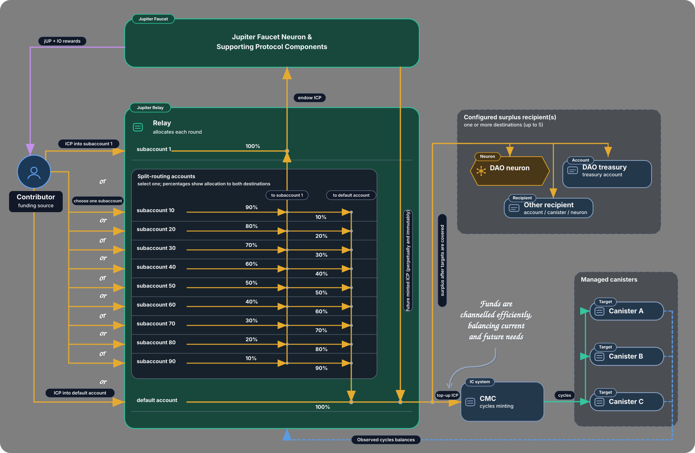

# Jupiter Relay

`jupiter-relay` is an autonomous ICP-to-cycles allocator for Internet Computer projects.

A Relay gives a project **one ICP funding destination** and uses that funding to keep a fixed set of canisters supplied with cycles according to their observed consumption. It measures cycles burn, converts ICP through the Cycles Minting Canister (CMC), tops up the canisters that need it, and can route genuine excess ICP to fixed surplus recipients instead of allowing cycles buffers to grow without bound.

Relay can use ordinary direct ICP funding, but it also integrates with [Jupiter Faucet](../faucet/README.md): a Faucet commitment can perpetually produce raw ICP for a Relay, while Relay decides how that ICP should be allocated as downstream needs change.



> **Diagram scope:** the diagram shows the common Relay flows. Its “up to 5” surplus-recipient annotation is a limit of the current **Historian self-service factory**, not of the Relay runtime itself.

See the suite overview in [`../../README.md`](../../README.md). Unless otherwise noted, command examples are run from the repository root.

## Why use a Relay?

Relay is useful when a project has several canisters, changing cycles demand, or a long-term funding source that could eventually exceed current operating needs.

- **One funding destination.** Fund the Relay instead of maintaining separate flows for application, storage, frontend, indexer, and other canisters.
- **Allocation follows demand.** Higher-burn canisters naturally receive more because Relay derives demand from observed cycles consumption rather than a fixed percentage split.
- **Surplus stays useful.** After the managed set is covered, excess ICP can go to a treasury, user/canister account, or public NNS neuron rather than becoming an unnecessarily large cycles buffer.
- **Current and future funding can be combined.** Relay can keep some ICP spendable now while routing another portion into a Jupiter Faucet commitment that feeds the Relay again in future.
- **Self-service deployment is immutable and observable.** The frontend/Historian flow can create a dedicated Relay, blackhole it after verification, and register both the Relay and its targets for Historian cycles tracking.

For example, a project with a low-burn frontend and a high-burn storage canister does not need to guess a permanent funding split. One Relay funding stream can follow the observed burn. If total burn later falls, or ICP rises enough that the stream becomes excessive, the residual ICP can leave the cycles loop through the configured surplus recipients.

## Create a self-service Relay

The frontend route [`#relay-setup`](https://jupiter-faucet.com/#relay-setup) uses [Jupiter Historian](../historian/README.md) as a factory for dedicated immutable Relay instances.

The current self-service configuration is:

- **1–20 managed target canisters**;
- either **zero surplus recipients** for all-cycles mode or **1–5 typed recipients**;
- a Principal/default-account or public NNS-neuron destination per recipient;
- an exact 0–32-byte Ledger memo per recipient, entered as text or hexadecimal; and
- no custom recipient weights, subaccounts, or automatic IO recipient; and
- a daily Relay cadence with automatic cycles-probe routing.

### Creation flow

1. Choose the targets and surplus recipients in the frontend.
2. Historian canonicalizes both lists and returns the deterministic setup account and current funding requirement for that complete configuration.
3. Fund the setup account, then explicitly press **Create Relay**. Funding alone never starts creation.
4. Historian verifies that every target is observable, creates the child canister, installs the reviewed Relay Wasm and immutable configuration, and sends the remaining eligible setup balance to the child's **subaccount 1**.
5. Historian verifies the installed module/settings, hands the child to the Fiduciary blackhole, verifies the final blackholed state, and records the configuration as active.
6. Historian adds `RelayTarget` tracking to the targets and `RelayInstance` tracking to the spawned Relay so their cycles histories can be sampled and shown by the frontend.

After activation, fund the **Relay itself**, not the setup account. Historian does not control, upgrade, reconstruct, or mutate a successfully blackholed child.

Targets, recipient destinations, and exact memo bytes jointly define the immutable configuration. One explicitly framed canonical encoder covers every configuration, including empty memos and zero recipients. Order does not matter, but changing any target, destination, type, or memo produces a different setup account and Relay configuration. Repeating the exact same configuration returns its existing active Relay rather than creating a duplicate.

Setup deposits are aggregate protocol deposits: Historian does not attribute them to individual payers and does not automatically refund an incorrectly funded configuration. The frontend's live funding requirement should be treated as authoritative because Historian rechecks the ICP ledger fee and CMC conversion rate before irreversible work.

The detailed factory state machine, funding formula, fail-closed reconciliation, `ManualRecoveryRequired` behavior, and deployment sequence are intentionally documented once in [`../../docs/relay-setup-recovery.md`](../../docs/relay-setup-recovery.md).

### Target observability

Relay must be able to measure cycles balances before it can allocate by burn. Self-service Historian therefore probes every target before spending setup ICP, and the child uses the shared **Auto** observation policy at runtime. Auto mode can use recognized blackhole and SNS status routes, including SNS-governed dapps that are not themselves blackholed.

A manually installed Relay can instead set `blackhole_canister_id`, selecting a fixed blackhole route for non-self targets.

A newly installed Relay is a replenishment controller, not an initial rescue mechanism: the first complete sample establishes a baseline and spends no default-account ICP. Targets should start with enough cycles to survive until a later sample can measure burn and fund them.

If a scheduled target probe fails, Relay fails closed for that target. After three consecutive scheduled failures it may classify the target as unavailable **for that run only**, allowing other observable targets to progress. Later ticks keep probing it, and any successful sample resets the failure count.

## Allocation model

Relay always adds **itself** to the effective managed set, so install arguments should list only the external targets.

After the baseline sample, recent burn is estimated as:

```text
estimated_burn_cycles = max(
  previous_cycles
  + relay_minted_cycles_since_previous_sample
  - current_cycles,
  0
)
```

Tracking cycles minted by Relay prevents a successful top-up from disguising the consumption that occurred between samples.

### With surplus recipients

With one to five self-service recipients, for each observable managed canister:

```text
new_burn_target_cycles = ceil(recent_burn_cycles × 101 / 100)
target_topup_cycles = carried_recovery_deficit_cycles + new_burn_target_cycles
```

The 1% headroom applies only to newly observed burn. A previous underfunding deficit is carried forward at face value.

Relay then:

1. calculates the ICP needed for the managed-canister top-ups using the CMC conversion estimate;
2. executes managed-canister top-ups first;
3. carries forward any unmet deficit caused by insufficient funding or transfer/notify failure; and
4. considers surplus only when the observable planned recovery deficit is cleared.

Surplus is divided equally across the configured recipients. Every recipient must be able to receive at least **1 ICP net of its own ledger fee**, so with fee `F` and `N` recipients Relay requires at least:

```text
N × (100,000,000 + F) e8s
```

of safely distributable ICP after managed-canister requirements and retained-balance accounting.

### Without surplus recipients

A self-service or manually installed Relay can configure no raw-ICP recipients. This selects **all-cycles mode**: available top-up funding is divided among positive cycles needs instead of preserving a raw-ICP surplus path. No recipient is inserted automatically and no raw-surplus Ledger transfer is produced.

All-cycles mode uses recent burn plus carried deficit without the 1% headroom and waits until the proportional shares are fee-efficient enough to spend. Dust and fee-unspendable balance remain in the default account for a later tick.

## Funding a Relay

Think of Relay funding as two buckets:

- **default account:** ICP Relay can spend on cycles now;
- **subaccount 1:** ICP Relay will use to create a Jupiter Faucet commitment that can feed its default account again in future.

The numbered splitter subaccounts divide one deposit between those buckets.

| Funding path | Immediate liquidity | Builds Faucet commitment | Best fit |
|---|---:|---:|---|
| Relay default account | 100% | 0% | Bootstrap, normal direct funding, recovery |
| Direct Jupiter Faucet commitment targeting Relay | Future Faucet payouts | 100% | Cleanest perpetual funding path |
| Relay subaccount 1 | 0% initially | 100% | Accumulation or memo repair |
| Splitter 10–90 | 10–90% | 90–10% | Blend current and future funding |

### Default account

The default account is:

```text
Account { owner = <relay principal>; subaccount = null }
```

ICP sent there is immediately available to the allocation loop. It is finite funding: once spent, it must be replenished by another payment or by a recurring source.

### Direct Jupiter Faucet commitment

If the sender can make a normal qualifying Faucet commitment and attach an ICRC memo, use:

```text
<relay-canister-id>.
```

The trailing `.` matters. Under [`jupiter-memo-policy`](../../crates/memo-policy), `canister_id.memo` requests **raw ICP** to that canister rather than a direct cycles top-up; an empty right-hand segment means no outgoing raw-ICP memo.

Jupiter Faucet then sends future payout ICP to Relay's default account. Faucet produces the recurring ICP; Relay decides how to allocate it.

### Subaccount 1

Relay subaccount 1 is 32 bytes with 31 zero bytes followed by `0x01`:

```text
owner = <relay principal>
subaccount = 0000000000000000000000000000000000000000000000000000000000000001
```

Incoming memos are irrelevant. On an accepted main tick, once the balance can send at least 1 ICP after the resolved ledger fee, Relay forwards `balance - fee` to the canonical Jupiter Faucet neuron staking account with a memo derived from its own principal:

```text
<relay principal without hyphens>.Relay
```

That creates a normal Faucet commitment targeting the Relay; future payouts return to the Relay's default account. Subaccount 1 is useful when the original sender cannot attach the Faucet memo or when many small deposits need to accumulate before they qualify.

Self-service creation deliberately sends the eligible remainder of setup funding here, so a new Relay starts by building its long-term funding base rather than merely holding deployment residue.

### Splitter subaccounts 10–90

Every Relay intrinsically recognizes subaccounts `10, 20, ... 90`. The number is the **gross percentage routed to the default account**; the complement goes to subaccount 1.

| Splitter | Default account | Subaccount 1 |
|---|---:|---:|
| 10 | 10% | 90% |
| 20 | 20% | 80% |
| 30 | 30% | 70% |
| 40 | 40% | 60% |
| 50 | 50% | 50% |
| 60 | 60% | 40% |
| 70 | 70% | 30% |
| 80 | 80% | 20% |
| 90 | 90% | 10% |

A numbered subaccount is 32 bytes with the number in the final byte. Each split pays one ICP ledger fee per leg, so both gross leg budgets must exceed the current fee. Small deposits simply remain until a later tick or additional deposit makes the split valid.

Splitter execution is sequential but durably journaled before the first transfer. The default-account leg executes first; the subaccount-1 leg follows only after the first leg is accepted (including ledger `Duplicate`). Deposits arriving after a split has been pinned are left for a later independent split.

Subaccount 90 is a practical “mostly now, gradually more forever” path: each payment keeps 90% available for current cycles needs while directing 10% toward the future Faucet-backed funding stream.

## Surplus recipients and reward attribution

Relay supports two raw-ICP surplus target types at install time:

```text
SurplusCanisterRecipient { canister_id = principal; memo = blob }
SurplusNeuronRecipient   { neuron_id = nat64; memo = blob }
```

A `SurplusCanisterRecipient` is paid to `Account { owner = principal; subaccount = null }`; despite the field name, that principal can represent a canister or another valid principal account. An empty memo blob means no outgoing ledger memo.

A public NNS neuron recipient is resolved through NNS Governance and paid to its staking subaccount. Relay then best-effort calls `claim_or_refresh_neuron`. A refresh failure does not repeat an already accepted ICP transfer. These are **NNS**, not arbitrary SNS, neuron IDs.

Self-service creation supports both forms and passes each exact 0–32-byte memo unchanged. An empty memo preserves the established no-memo transfer semantics. No IO recipient or other protocol recipient is added automatically.

### SNS reward attribution

Reward attribution is a separate bounded stage; it does not change the cycles-allocation rules. Once per week, at the start of an accepted daily main tick, Relay asks the configured [`jupiter-sns-rewards`](../sns-rewards/README.md) canister for a fresh completed owner snapshot and its Root-resolved token Ledger. Relay never caches the SNS Ledger ID. It then reads its live reward-token balance and that Ledger's live `icrc1_fee`; the ICP fee cache and `10_000` e8s bootstrap fallback do not apply. A transfer is economical only when the balance exceeds the fee and `fee * 10 <= balance - fee`. Exactly 10% qualifies; anything greater waits with the token pot untouched. A pending transfer is driven on every daily tick.

Relay scans its own subaccount-1 account through the real ICP Index, bounded to 10 pages and 10,000 transactions. The first sweep for each SNS Root may consider all bounded historical completed commitments. Later sweeps begin strictly after the stable processed Faucet-commitment transaction ID, plus one narrow older overlap when an unconsumed carried credit precedes that cursor. Transactions at or after the owner snapshot's scan-start timestamp wait for a later snapshot.

Relay stages each Faucet transfer from a previously observed subaccount balance. A whole incoming credit may be recorded before the outgoing Faucet transfer even when it arrived after that balance read. The reward parser therefore reconstructs a commitment by consuming the oldest exact FIFO prefix of whole credits whose sum equals the outgoing Faucet amount plus that transaction's actual ICP fee. It never splits a credit. Newer unconsumed credits that precede the completed commitment are retained in order and carried into the next reward batch with one stable transaction-ID boundary. Ordinary trailing credits after the latest commitment are newer than the processed cursor and are naturally discovered by the next scan.

Direct funding remains a one-hop reconstruction: `contributor -> subaccount 1 -> Faucet`. If a consumed subaccount-1 credit came from one of Relay's exact intrinsic splitter accounts 10, 20, …, or 90, Relay follows one additional deterministic hop through that splitter's real ICP Index history: `contributor -> splitter -> subaccount 1 -> Faucet`. Only splitter histories referenced by the current consumed commitment batch are scanned, so one adjudication reads one subaccount-1 history plus at most nine independently bounded splitter histories. Relay anchors the two views with the exact global transaction ID of the splitter's SubaccountOne leg; it never matches a split by amount or timestamp.

For a completed splitter job, Relay validates the historical default-first two-leg shape, recorded fees, destinations, percentage arithmetic, and whole-credit pinned starting balance. Each historical leg is reconstructed from its own recorded amount and fee; the two fees may differ if the ICP Ledger fee changed between the legs. The reward-bearing total is only the actual net amount received by subaccount 1. The immediate-liquidity/default-account leg and both splitter fees receive no reward weight. If several chronological deposits formed the pinned balance `B` and the actual SubaccountOne amount is `S`, credit `i` receives `floor(prefix_i × S / B) - floor(prefix_(i-1) × S / B)`. This cumulative-floor allocation uses integer arithmetic, conserves exactly `S`, and spreads liquidity, fees, and rounding proportionally instead of charging one contributor arbitrarily.

A deposit arriving after a splitter balance was pinned belongs to the next split even if its ledger transaction ID precedes the old SubaccountOne leg. Splitter attribution therefore has its own durable per-splitter cursor and narrow carried-credit overlap. Historical overlap restores carried incoming credits only; it never replays already-adjudicated outgoing legs. Unexpected splitter debits, malformed pairs, missing funding, pagination truncation, or an inexact transaction anchor fail closed with the reward pot and every boundary unchanged.

An eligible source is an indexed SNS neuron owner's exact default ICP account (`subaccount = null`), not Relay subaccount 1 or a splitter account. Splitter expansion recovers the original AccountIdentifier and passes it to the unchanged owner resolver. Named subaccounts, exchanges, custodians, wallet canisters, unknown accounts, and proportionally allocated mints remain ineligible. Owner discovery is automatic and has no registration endpoint. The completed owner snapshot may classify the preceding unprocessed commitment batch retroactively. The 128-source bound applies after direct and expanded external AccountIdentifiers are merged; intrinsic splitter accounts do not consume contributor slots.

Eligible credits aggregate per principal. All unknown and minted funding forms one competing ineligible bucket. One principal wins the whole current economical token pot only if its eligible total is uniquely largest among eligible principals and strictly exceeds the ineligible total. Contributor ties are never broken. A definitive tie or no-winner batch advances the main commitment cursor and every involved splitter boundary without sending tokens, so only the token pot rolls forward; a later unique winner may receive that accumulated pot.

This is not a proportional or historically exact donor-reward system. It is a deliberately bounded protocol-oriented attribution policy for a blackholed Relay.

The transfer identity pins Ledger, recipient, amount, explicit fee, versioned commitment memo, creation timestamp, the proposed next main carry boundary, and every proposed splitter boundary update in stable memory before the first await. Success and `Duplicate` advance the main and splitter boundaries together. A first-attempt definitive rejection clears the pending transfer without advancing any boundary; an explicit retryable rejection retries once with the identical identity. Transport uncertainty followed by anything other than success or `Duplicate` becomes stable ambiguity. An ambiguous transfer blocks only new reward adjudication, never ordinary ICP work, and retains every proposed boundary across upgrades. A later pinned-ledger balance below the original observed balance proves acceptance; otherwise, while the pinned creation timestamp remains valid, Relay may retry the exact same identity once per pending drive. Success or `Duplicate` resolves it, while every other result remains ambiguous. No new identity, reward-ledger history scan, force-clear endpoint, fee fallback, or Ledger cache is used.

The SNS Root defines the epoch. A new Root resets the main commitment cursor, main carried-credit boundary, and every splitter attribution boundary only when no prior pending transfer exists. Operators must not switch Root while any Relay reports a pending or ambiguous reward transfer. This implementation starts forward from the preserved main cursor: it does not rewind already-adjudicated pre-fix batches, because doing so could re-award direct contributions or an already-paid reward. Any historical economic remediation is a separate operator decision.

## Runtime, failure and retry model

The default main interval is one day and is clamped to at least 60 seconds. Current self-service and canonical production Relays use the daily cadence.

On an accepted main tick, stages run in this order:

1. SNS reward work;
2. numbered splitter work;
3. subaccount-1 Faucet forwarding; and
4. default-account cycles allocation and possible surplus routing.

The value-moving paths are designed around fixed transfer identities and fail-closed ambiguity handling:

- a new fee-dependent plan queries the ICP Ledger's live `icrc1_fee`, falling back to an in-memory last-known fee and then a `10_000` e8s bootstrap value if necessary;
- staged transfers pin their amount, fee, memo and `created_at_time`; retrying reuses the same identity and ledger `Duplicate` counts as accepted;
- after an accepted CMC transfer, retryable `notify_top_up` uncertainty is retried once inline and then recorded as ambiguous rather than creating a second ICP transfer;
- unresolved ordinary recovery deficits block surplus;
- splitter state and reward-transfer state use isolated stable journals so ambiguous or in-flight identities can survive a same-canister upgrade; and
- if a splitter remains uncertain beyond safe ledger deduplication, that exact splitter identity is quarantined instead of guessed, while unrelated Relay work can continue.

`max_transfers_per_tick`, when configured, limits only outgoing ICP-ledger transfers started by the **default-account allocation job**. Splitter and subaccount-1 work are separate stages. Historian sets the self-service value to `target_count + recipient_count + 1`, where the final slot covers Relay itself.

## Public interface and observability

Production Relay intentionally exposes **no application methods** after initialization:

```did
service : (InitArgs) -> {}
```

Targets, recipients, withdrawals, transfers, and recovery cannot be changed through a production endpoint. Debug builds expose test helpers such as `debug_state`, `debug_config`, `debug_last_summary`, `debug_main_tick`, reward helpers and fault injection; they are for local/PocketIC use only and are guarded against use at the embedded canonical production Relay principal. See [`jupiter_relay_debug.did`](jupiter_relay_debug.did).

Public canister logs are therefore an important verification surface. Every main tick that actually runs emits the Relay cycles balance and a `CONFIG` record describing the effective runtime wiring. Operational records include:

```text
Cycles:
CONFIG
RELAY_SUMMARY
RELAY_CANISTER
RELAY_SURPLUS_TRANSFER
RELAY_SPLITTER
RELAY_FAUCET_COMMITMENT
RELAY_PROBE_FAILURE
RELAY_TARGET_PROBE
relay LIFECYCLE
relay ERR
```

`RELAY_SUMMARY` is the main per-tick accounting record; the other records provide actionable target, transfer, splitter, Faucet-forwarding and probe detail. Logs have finite retention, so operators needing durable history should archive them externally. Self-service Relay and target **cycles histories** are separately tracked by Historian.

## External dependencies and install configuration

By default Relay talks to:

- ICP Ledger (`ryjl3-tyaaa-aaaaa-aaaba-cai`) — balances, transfers and live ledger fee;
- CMC (`rkp4c-7iaaa-aaaaa-aaaca-cai`) — ICP/XDR conversion and cycles top-up notification;
- NNS Governance (`rrkah-fqaaa-aaaaa-aaaaq-cai`) — Relay Faucet-neuron staking and public NNS neuron surplus recipients;
- ICP Index (`qhbym-qaaaa-aaaaa-aaafq-cai`) — subaccount-1 and referenced splitter reward-attribution history;
- `jupiter-sns-rewards` (`alk7f-5aaaa-aaaar-qb4ra-cai`) — SNS owner snapshots and reward-token context; and
- the configured fixed blackhole (canonical default `77deu-baaaa-aaaar-qb6za-cai`) or shared Auto probe routes — target cycles observation.

The public install type is defined in [`jupiter_relay.did`](jupiter_relay.did):

```did
type SurplusCanisterRecipient = record { canister_id : principal; memo : blob };
type SurplusNeuronRecipient = record { neuron_id : nat64; memo : blob };
type InitArgs = record {
  managed_canisters : vec principal;
  ledger_canister_id : opt principal;
  cmc_canister_id : opt principal;
  governance_canister_id : opt principal;
  blackhole_canister_id : opt principal;
  sns_rewards_canister_id : opt principal;
  icp_index_canister_id : opt principal;
  main_interval_seconds : opt nat64;
  max_transfers_per_tick : opt nat32;
  surplus_canister_recipients : opt vec SurplusCanisterRecipient;
  surplus_neuron_recipients : vec SurplusNeuronRecipient;
};
service : (InitArgs) -> {};
```

Omitted dependency IDs use the canonical mainnet defaults compiled into the Wasm. `blackhole_canister_id = null` selects Auto probe mode; providing one selects Fixed mode. `max_transfers_per_tick = null` removes the default-account transfer cap. No raw-ICP recipients selects all-cycles mode.

### Lifecycle

Relay upgrades are replacement-style and non-resumable. Relay does not support no-arg upgrades, does not support Relay UpgradeArgs, and requires full InitArgs for every replacement. Avoid upgrading during active Relay work where practical.

Install, reinstall and upgrade all initialize ordinary heap state from full `InitArgs`. An upgrade therefore resets ordinary cycle samples, deficits, cached fee/conversion state, default-account allocation work and subaccount-1 forwarding state.

Two versioned stable journals survive ordinary same-canister upgrades:

- stable memory 0 contains SNS reward attribution state: the epoch Root, main Faucet-commitment cursor and carry, the nine bounded splitter attribution cursors and carries, the last weekly sweep attempt, and any fully pinned pending reward-token transfer with its proposed splitter-boundary updates;
- stable memory 1 independently stores splitter execution transactions, driver-fencing revisions and quarantine evidence.

Memory 0 uses an explicit V2 schema. On first access after upgrade it migrates the frozen prior V1 wire shape once, preserving every old pending-transfer identity field while initializing the new splitter boundaries and any old pending splitter proposals empty. Runtime reward logic then uses only V2. Reward attribution reconstructs provenance from ICP Ledger/Index history; it does not derive it from the mutable splitter execution journal in memory 1.

An active splitter requires the replacement args to retain the same ICP Ledger, otherwise the upgrade fails closed. A reinstall clears both journals with the canister's stable memory. Avoid controller-managed upgrades during active value-moving work where practical, especially ICP top-ups, ambiguous ordinary ICP transfers, CMC notify sequences, active splitter work, or pending reward transfers. After upgrade, verify the fresh `CONFIG` log, stable-journal continuation where applicable, the first successful `BaselineOnly` ordinary allocation tick, and managed-canister cycle balances. Self-service blackholed Relays are not upgraded by Historian at all.

The suite-wide lifecycle matrix and deployment cautions live in [`../../docs/operations/deployment.md`](../../docs/operations/deployment.md).

## Jupiter Faucet's canonical Relay

Jupiter Faucet uses the same Relay design to fund its own suite. The production instance recorded in this repository is:

```text
jupiter_relay
u2qkp-aqaaa-aaaar-qb7ea-cai
```

### Canonical ICP funding accounts

For the canonical Relay, the following are the **legacy ICP Ledger account identifiers** (the 64-character hexadecimal addresses), rather than only the ICRC owner/subaccount notation. These are the Relay-owned ICP accounts used for immediate funding, Faucet-commitment staging, and the fixed splitter routes.

| Relay account | Purpose | Subaccount byte | ICP Ledger account identifier |
|---|---|---:|---|
| Default | ICP available for managed-canister top-ups and eventual surplus | `00` (ICRC default / `null`) | `ffe4e010416d894b2a973fa46212c14c9c83363fa886f7216c3b1c9fa50a30cd` |
| Subaccount 1 | Jupiter Faucet commitment staging | `01` | `9fffa5e0762fd8be8e4c3078d4101926fb8d3c15aa3fa077b981ea779ded42ee` |
| Splitter 10 | 10% default / 90% subaccount 1 | `0a` | `888cbe557e118986bfdd515c6d7622dc54a0a83b6bff17287134fa514a805594` |
| Splitter 20 | 20% default / 80% subaccount 1 | `14` | `4f74f3f8320540a1998c4ff4da9264f166ba8546cbaef9650177c573cb913619` |
| Splitter 30 | 30% default / 70% subaccount 1 | `1e` | `a6b8c79aad7424c51f566db0781060404a1e13f2c9b96531fbd8664759967c84` |
| Splitter 40 | 40% default / 60% subaccount 1 | `28` | `75b0acc13f98dd766111e510682c4038b32f4e165d60f26457ebf741e119cff8` |
| Splitter 50 | 50% default / 50% subaccount 1 | `32` | `ddc112cd674286bc5342c933ad70b94d5a6f956f08283a9cfc2dacc7346df034` |
| Splitter 60 | 60% default / 40% subaccount 1 | `3c` | `98394d5d6d5438c1629b9801574478c63170c115df9ae2c02b223e8b501b8fd5` |
| Splitter 70 | 70% default / 30% subaccount 1 | `46` | `3d27e1558913c4771959af6119e9758c79e548c75ee6951da7f1fc726a0760e7` |
| Splitter 80 | 80% default / 20% subaccount 1 | `50` | `1f2e1e0d228cda21e9bb2852554362739a8c955755c2034ee04893d38a47442a` |
| Splitter 90 | 90% default / 10% subaccount 1 | `5a` | `7dd38b0e9fa61ec7075d730fa3fe6026fb128b816e36d4007bcd937a3cd52f3e` |

For the numbered accounts, the full subaccount is 32 bytes: 31 zero bytes followed by the byte shown above. The default ICRC account is `Account { owner = u2qkp-aqaaa-aaaar-qb7ea-cai; subaccount = null }`; the legacy account-identifier derivation uses the canonical all-zero default subaccount.

Its checked-in configuration is [`mainnet-install-args.did`](mainnet-install-args.did). It manages the suite canisters plus the two production blackholes, with Relay itself auto-included:

```text
jupiter_disburser           uccpi-cqaaa-aaaar-qby3q-cai
jupiter_lifeline            afisn-gqaaa-aaaar-qb4qa-cai
jupiter_faucet              acjuz-liaaa-aaaar-qb4qq-cai
jupiter_sns_rewards         alk7f-5aaaa-aaaar-qb4ra-cai
jupiter_faucet_frontend     jufzc-caaaa-aaaar-qb5da-cai
jupiter_historian           j5gs6-uiaaa-aaaar-qb5cq-cai
blackhole_fiduciary_subnet  77deu-baaaa-aaaar-qb6za-cai
blackhole_13_node_subnet    e3mmv-5qaaa-aaaah-aadma-cai
relay, auto-included        u2qkp-aqaaa-aaaar-qb7ea-cai
```

The canonical Relay uses Fixed probe mode through the Fiduciary blackhole, a daily cadence, and two equal public NNS neuron surplus recipients:

- IO neuron `10292412127977304661` with no memo;
- Jupiter Faucet neuron `11614578985374291210` with memo `10292412127977304661`.

The second recipient compounds part of genuine surplus back into the stake that produces future Jupiter Faucet maturity; the other half grows the IO neuron stake. This is a protocol-specific example, not a requirement for self-service Relays.

Historian reserves this canonical target set so it cannot be recreated through the self-service API with a different recipient configuration.

## Build, test and reproducible verification

Production build:

```bash
cargo build -p jupiter-relay --target wasm32-unknown-unknown --release --locked
```

Debug build:

```bash
cargo build -p jupiter-relay --target wasm32-unknown-unknown --release --features debug_api --locked
```

Unit tests can also be run directly with `cargo test -p jupiter-relay --lib`. Preferred repo-aware test entry points are:

```bash
cargo run -p xtask -- relay_unit
cargo run -p xtask -- relay_local_integration
cargo run -p xtask -- relay_pocketic_integration
cargo run -p xtask -- relay_all
```

The Relay integration suite covers configuration wiring, cycles probes, CMC top-ups, equal surplus routing, all-cycles mode, live-fee handling, duplicate-safe transfer recovery, transfer caps, subaccount-1 forwarding, fixed splitters, upgrade/stable-journal behavior, production/debug API boundaries, and SNS reward attribution. See [`../../tools/xtask/README.md`](../../tools/xtask/README.md) for the suite-wide matrix.

For canonical release artifacts and module-hash verification, use the pinned Docker build:

```bash
./tools/scripts/docker-build
```

This produces `release-artifacts/jupiter_relay.wasm` and `.wasm.gz` plus hashes. The same release flow builds the factory-enabled Historian with the reviewed raw Relay Wasm embedded; Historian verifies spawned children against that approved module hash before activation. See [`../../docs/operations/reproducible-builds.md`](../../docs/operations/reproducible-builds.md).

## Canonical Relay operations

These commands apply to the controller-managed canonical Jupiter Faucet Relay, **not** to immutable self-service children.

Relay requires full `InitArgs` on every upgrade:

```bash
JUPITER_USE_CANONICAL_ARTIFACTS=1 icp deploy jupiter_relay \
  --environment ic \
  --mode upgrade \
  --args-file canisters/relay/mainnet-install-args.did
```

After an upgrade, verify the fresh `CONFIG` log, expect the first successful complete ordinary allocation sample to be `BaselineOnly`, inspect managed-canister cycles balances, and reconcile any externally ambiguous pre-upgrade ordinary work before increasing funding.

Fresh install and destructive reinstall use the same checked-in args with `--mode install` or `--mode reinstall`. Reinstall also clears the stable journals and should be used only for an intentionally fresh deployment.

Useful production checks:

```bash
./tools/scripts/smoke-relay-mainnet
icp canister logs u2qkp-aqaaa-aaaar-qb7ea-cai -n ic
```

For the full production lifecycle, settings/handoff procedure, rollback guidance and cross-canister deployment order, use [`../../docs/operations/deployment.md`](../../docs/operations/deployment.md) rather than duplicating it here.

## Related documentation

- [Suite overview](../../README.md)
- [Jupiter Faucet](../faucet/README.md) — commitment and raw-ICP source used for perpetual Relay funding
- [Jupiter Historian](../historian/README.md) — self-service factory and public cycles histories
- [Jupiter frontend](../frontend/README.md) — browser Relay Setup and tracker behavior
- [Self-service Relay configuration and recovery](../../docs/relay-setup-recovery.md) — factory state machine and recovery rules
- [Jupiter SNS Rewards](../sns-rewards/README.md) — owner snapshots used by reward attribution
- [Deployment operations](../../docs/operations/deployment.md) — lifecycle matrix and production procedures
- [Reproducible builds](../../docs/operations/reproducible-builds.md) — canonical artifact verification
- [`jupiter-memo-policy`](../../crates/memo-policy) — Faucet memo forms used for raw-ICP Relay funding
