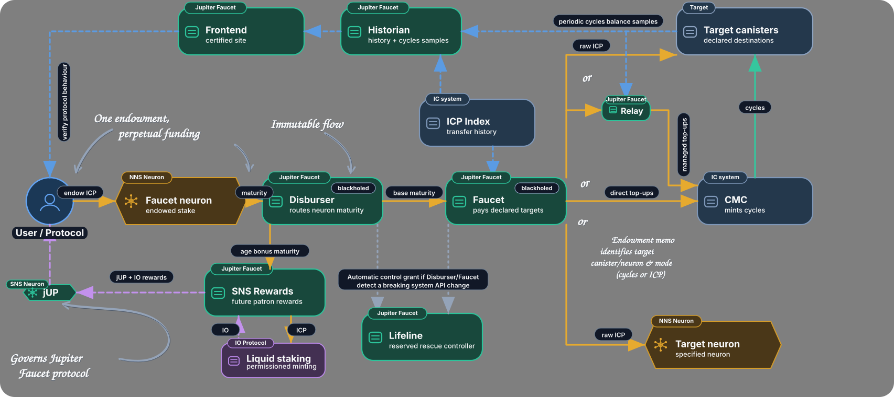

# Jupiter Faucet as shared infrastructure

This document is an explanatory architecture and product-orientation guide for Internet Computer developers. It is not the source of exact monetary, eligibility, retry, recovery, or deployment rules. Those remain defined by the [component READMEs](../../canisters), Candid interfaces and source, together with the relevant [deployment](../operations/deployment.md), [reproducible-build](../operations/reproducible-builds.md), and security documentation.

## Why this layer exists

An IC project often begins with application logic and later discovers a second, largely independent infrastructure problem:

- how to keep one canister or a changing set of canisters funded;
- how much cycles buffer to maintain;
- how to manage an ICP reserve and whether some of it should be staked;
- how to harvest and route NNS maturity;
- how to avoid overfunding cycles when demand falls;
- what to do with funding that exceeds current infrastructure needs; and
- how to make that machinery reviewable enough to depend on over a long period.

These concerns matter, but they are usually orthogonal to the reason the application exists. Reimplementing them inside every project creates repeated monetary code, scheduler and retry logic, operational procedures, and audit surface.

Jupiter Faucet exists as a reusable protocol layer for this common work. It can turn a durable ICP commitment and recurring NNS maturity into long-term funding routes, allocate cycles according to observed demand, route supported non-cycles outputs, and publish an observable history around those flows. A project can compose only the facilities it needs instead of operating a bespoke treasury, neuron, maturity-routing, and cycles-automation stack.

This does not make Jupiter responsible for the application's economics. The project still owns every decision that depends on its users, product, governance, or business model.

## Benefits of the shared mainnet deployment

Jupiter Faucet's primary integration model is a common mainnet primitive. A project makes its commitment through the canonical Jupiter Faucet already deployed on IC mainnet and selects the supported route that fits its application. This lets the project compose with the established productive stake, recurring maturity machinery, public route history, and shared verification surface.

When a project needs managed multi-canister allocation, the production frontend and Historian can create a dedicated self-service Relay for its exact configuration. The project gets an immutable allocation instance tailored to its targets and surplus destinations while retaining the benefits of the shared protocol's reviewed factory, observability, and funding routes.

This repository includes build, installation, upgrade, and recovery material so the canonical deployment can be operated and independently verified, and so contributors can test and extend the system locally. Application developers can instead begin at the integration layer: choose a supported commitment route or create a self-service Relay through the deployed protocol.

Using a common deployment also concentrates review, integrations, operational evidence, and ecosystem knowledge around one protocol instead of reproducing the same monetary machinery in isolated project deployments. Network effects are especially relevant to economic primitives: a shared liquid-staking or reward asset can become more useful as its liquidity, integrations, and counterparties grow, while many application-specific wrappers fragment those effects. This is a composability rationale, not a guarantee of adoption, liquidity, or asset value.

## The separation of concerns

| Concern | Usually application-specific? | Jupiter role |
| --- | --- | --- |
| Decide which user behaviour deserves rewards | Yes | None |
| Game- or business-specific incentive weighting | Yes | None |
| Maintain project canisters' cycles | Usually generic | Faucet or Relay |
| Allocate cycles across multiple canisters | Usually generic | Relay |
| Turn long-term ICP into recurring funding | Usually generic | Faucet commitment |
| Route NNS maturity | Usually generic | Disburser and Faucet |
| Decide what happens to surplus after infrastructure needs | Destination is policy-specific; execution is generic | Relay |
| Maintain bounded public operational history and observability | Generic infrastructure | Historian |
| Provide a liquid-staking reward asset | Separate concern | [IO](https://github.com/aodl/IO), not Jupiter Faucet itself |

The boundary is about responsibility, not about forcing one deployment pattern. A single-canister project may use only a direct Faucet commitment. A multi-canister project may use a Relay with or without Faucet. Another project may keep its existing treasury policy and use Jupiter only for one funding route.

## Composition model

Jupiter Faucet is a set of composable primitives rather than a monolithic service:

1. **Direct Faucet commitment.** A qualifying commitment participates in recurring Faucet payouts. Its exact route selects cycles top-ups to a canister, raw ICP to a canister account with exact memo bytes, or supported NNS neuron staking-account funding. The [Faucet README](../../canisters/faucet/README.md) defines the exact commitment, memo, payout, fee, and best-effort delivery rules.
2. **Observed-demand allocation through Relay.** A [Relay](../../canisters/relay/README.md) gives a project one ICP funding destination, measures cycles consumption for its configured canisters, and allocates top-ups from current need rather than a permanent percentage split.
3. **Faucet and Relay together.** A Faucet commitment can route recurring raw ICP to a Relay. Faucet supplies the long-term funding stream; Relay decides how the currently available ICP should serve the application's changing infrastructure needs.
4. **Immediate and future funding.** Relay's intrinsic splitter accounts divide a deposit between its immediately spendable default account and subaccount 1, which builds a Faucet commitment that can feed the Relay again. The supported fixed splits are documented in [Funding a Relay](../../canisters/relay/README.md#funding-a-relay).
5. **Surplus outside the cycles loop.** In recipient mode, Relay considers surplus only after observable planned recovery deficits are cleared. It can then route that surplus to configured principal/default-account or public NNS neuron recipients. A Relay with no recipients instead remains in all-cycles mode.

These pieces reduce duplicated infrastructure; they do not guarantee a funding outcome. Payouts, cycles conversion, fees, target observability, and delivery remain subject to the component rules and external IC services described in the authoritative READMEs.

## Common project patterns

### Single-canister long-term funding

A project makes a Faucet commitment directly targeting its canister. The project keeps its application logic but does not need to operate its own recurring maturity-harvesting and cycles top-up scheduler for that route.

### Multi-canister application

A project creates a Relay for its backend, frontend, indexer, storage, or other canisters. Relay observes their cycles consumption and allocates available funding dynamically instead of requiring the project to maintain fixed percentages as usage changes.

### Project endowment

A project combines Faucet and Relay for a long-term funding path. Relay splitter funding can leave one portion available for current infrastructure while directing another portion toward a Faucet commitment that may produce future funding.

### Cycles first, treasury second

A project configures Relay surplus recipients for its treasury account or a public NNS neuron. Relay funds measured infrastructure recovery requirements first and routes only safely distributable surplus after those requirements are covered.

## What Jupiter Faucet deliberately does not decide

Jupiter does not need to know why a user is valuable to another application, which actions deserve incentives, how anti-sybil or anti-extraction rules should work, how game or application rewards should be weighted, how product revenue should be divided, or how that application's governance should vote. Those decisions depend on context Jupiter does not have and should remain in the application or its governance.

The design principle is:

> Keep application-specific incentive logic in the application; externalise generic financial and infrastructure plumbing where that reduces duplicated complexity.

An application with a sophisticated bespoke incentive model can therefore preserve that model while using only the lower-level Jupiter facilities that fit its operating design.

## Relationship with IO

[IO](https://github.com/aodl/IO) is a separate, complementary **pre-launch** project. IO is not yet release-ready or live. Its intended destination is a widely decentralised mainnet deployment, while launch timing and final production configuration remain subject to the open work, external audit, and separate authorization recorded in its repository. Jupiter Faucet does not currently issue IO, and a Faucet commitment or Relay configuration does not give an arbitrary downstream project automatic IO issuance.

The intended division of concerns is:

- Jupiter Faucet addresses productive ICP commitments, NNS maturity routing, cycles sustainability, raw ICP or supported neuron routes, and the related allocation and observation infrastructure.
- IO addresses the separate liquid-staking and reward-asset problem.
- An application can retain its own reward eligibility and business logic while evaluating shared infrastructure beneath that logic as separate components.

The current [`jupiter-sns-rewards`](../../canisters/sns-rewards/README.md) canister maintains owner snapshots and supplies snapshot-scoped context used by Relay's implemented reward-attribution path. The broader general SNS rewards programme and live IO integration remain future work.

## Why trust properties matter more for shared infrastructure

Externalising generic infrastructure is useful only if the external layer is unusually reviewable and its authority boundaries are concrete. Jupiter's relevant properties are implementation choices rather than blanket claims of security or decentralisation:

- **Narrow monetary roles.** Disburser, Faucet, and Relay have distinct value-moving responsibilities. Historian and the certified frontend are observation and presentation surfaces rather than payout authority. See [Canister roles](canister-roles.md).
- **Immutable self-service instances.** Historian installs and verifies a dedicated self-service Relay, removes every controller while retaining public logs and public status, and then records the active configuration. Historian cannot later upgrade or reconstruct that controllerless child. The exact state machine and recovery boundary are documented in [Relay setup and recovery](../relay-setup-recovery.md).
- **Public operational evidence.** Components publish runtime configuration and status through documented logs and read surfaces. Historian maintains bounded commitment, output, rewards, and cycles views; full transfer authority remains with the relevant ledgers and indexes. See the [Historian README](../../canisters/historian/README.md).
- **Reproducible release evidence.** The repository documents canonical Docker builds and comparison of installed package hashes with live module hashes. This connects reviewed source to deployed Wasm without treating an ordinary local build as reproducibility proof. See [Reproducible builds](../operations/reproducible-builds.md).
- **Conservative external effects.** The value-moving components document persisted plans or fixed transfer identities, duplicate handling, ambiguity classification, and fail-closed boundaries rather than assuming an uncertain external call did not happen. The exact guarantees and exceptions are component-specific; see the [Disburser transfer model](../../canisters/disburser/README.md#transfer-planning-and-retry-semantics), [Faucet retry model](../../canisters/faucet/README.md#retry-and-failure-behavior), and [Relay runtime model](../../canisters/relay/README.md#runtime-failure-and-retry-model).
- **Explicit recovery posture.** Blackhole and rescue-controller policies are documented where they apply, with component-specific health windows and operational preconditions. Controllerless self-service Relays use a different, immutable posture rather than sharing a generic recovery claim.
- **Visible governance relationships.** The Disburser documents its fixed maturity policy, including the D-QUORUM relationship and the current production wiring, rather than leaving governance-related routing implicit. See the [Disburser README](../../canisters/disburser/README.md).

These properties make independent review possible. They do not remove the need for a project to assess protocol, governance, integration, market, and operational risks for its own use case.

## Existing diagrams

The broadest high-level view is the suite overview below. It shows the relationship between a long-term ICP commitment, recurring maturity and output, direct Faucet routes, Relay-managed cycles allocation, observability, and the intended relationship with the pre-launch IO project.

For project funding, the Relay diagram is more focused: it shows one funding destination, the immediate-versus-future splitter paths, observed cycles demand across managed canisters, and surplus leaving the cycles loop after targets are covered.

For the simplest direct integration, see the [perpetual canister top-ups diagram](../../canisters/frontend/public/perpetual-canister-topups.svg).
